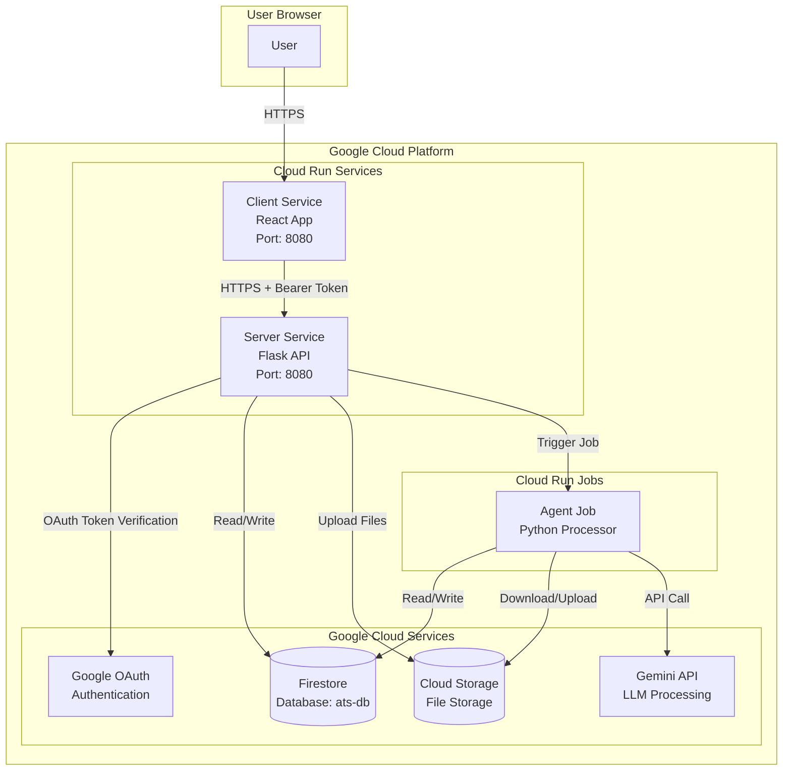
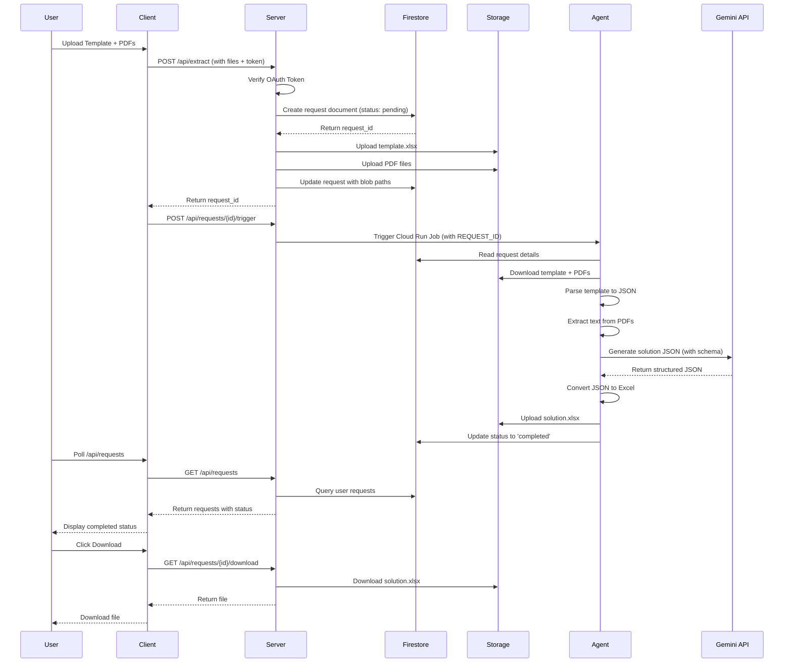
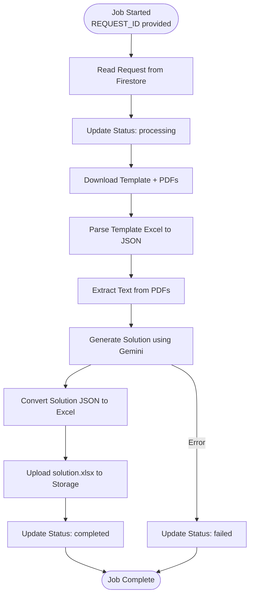
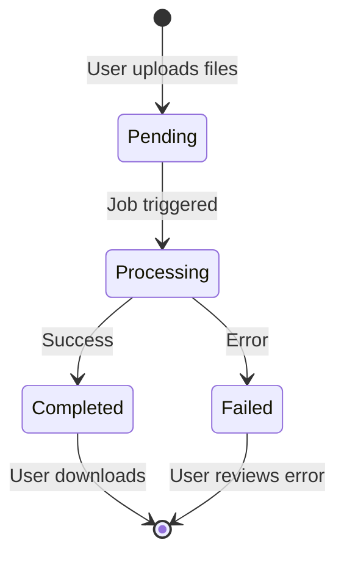
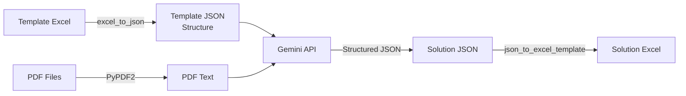
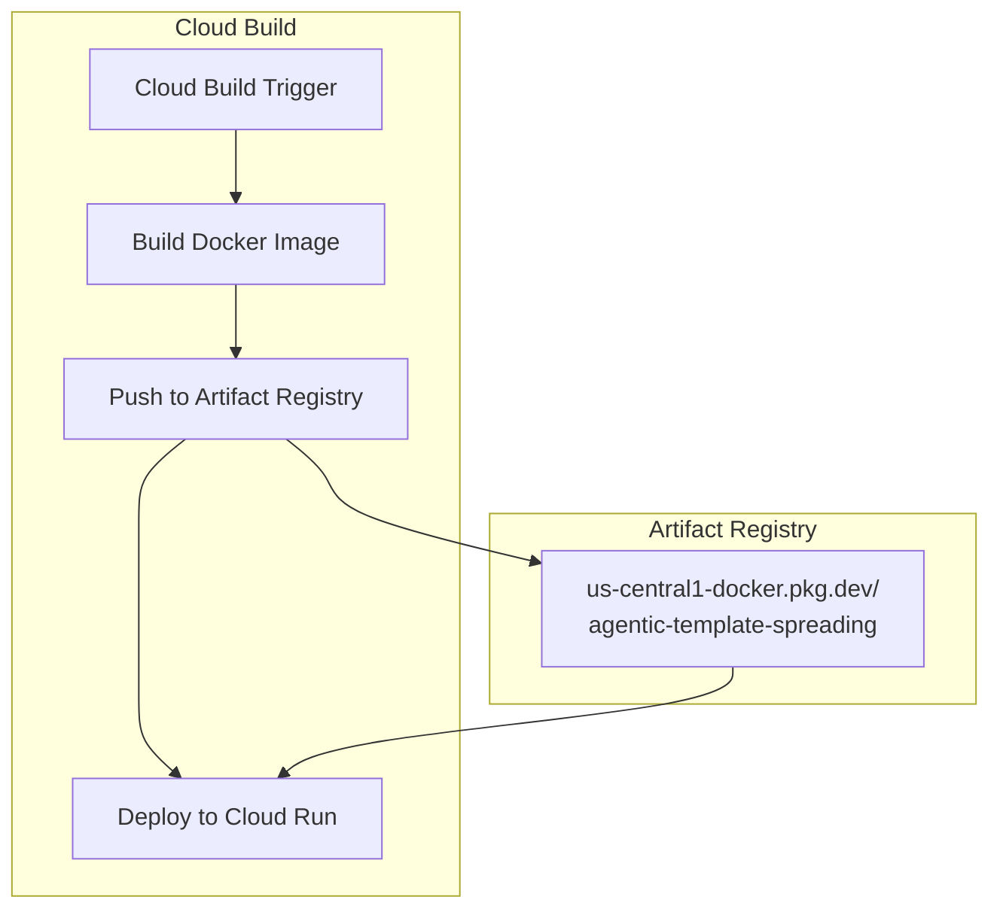
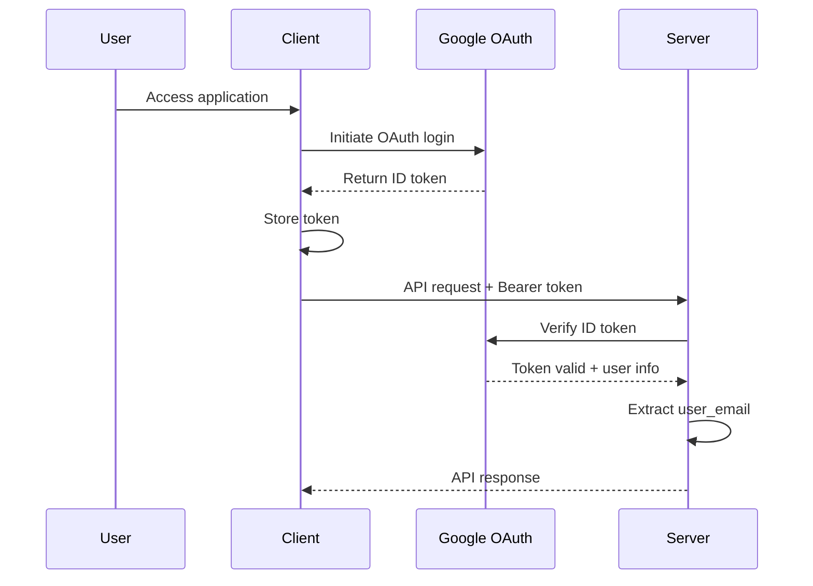

# Agentic Template Spreading - System Documentation

## Table of Contents
1. [Overview](#overview)
2. [Architecture](#architecture)
3. [Components](#components)
4. [Request Flow](#request-flow)
5. [Data Flow](#data-flow)
6. [Deployment Architecture](#deployment-architecture)
7. [Technology Stack](#technology-stack)
8. [API Endpoints](#api-endpoints)
9. [Storage Structure](#storage-structure)
10. [Authentication & Authorization](#authentication--authorization)
11. [Error Handling](#error-handling)

---

## Overview

**Agentic Template Spreading** is a cloud-native application that extracts financial data from PDF documents and populates Excel templates using AI/LLM capabilities. The system is built on Google Cloud Platform and consists of three main components:

- **Client**: React-based web application (Cloud Run Service)
- **Server**: Flask REST API (Cloud Run Service)
- **Agent**: Python processing job (Cloud Run Job)

### Key Features
- PDF text extraction from multiple documents
- AI-powered data extraction using Google Gemini API
- Excel template population with structured data
- Asynchronous job processing
- User authentication via Google OAuth
- Real-time request status tracking

---

## Architecture

### High-Level Architecture Diagram



### Component Interaction Flow



---

## Components

### 1. Client (React Application)

**Location**: `client/`  
**Type**: Cloud Run Service  
**Port**: 8080  
**Technology**: React, Vite, TailwindCSS

#### Responsibilities
- User interface for file uploads
- Google OAuth authentication
- Request management and status polling
- File download functionality
- Excel file comparison (Diff feature)

#### Key Features
- **PDF Extraction Tab**: Upload template Excel and PDF files
- **Excel Diff Tab**: Compare two Excel files cell-by-cell
- Real-time request status updates (30-second polling)
- Automatic Cloud Run job triggering after request creation

#### Environment Variables
- `VITE_APP_API_URL`: Server API endpoint URL
- `VITE_APP_GOOGLE_CLIENT_ID`: Google OAuth client ID

#### Deployment
- Built as static files and served via Nginx in Docker
- Deployed to Cloud Run as a service
- Uses service account: `ats-deploy@agentic-template-spreading.iam.gserviceaccount.com`

---

### 2. Server (Flask API)

**Location**: `server/`  
**Type**: Cloud Run Service  
**Port**: 8080  
**Technology**: Flask, Python 3.11, Gunicorn

#### Responsibilities
- REST API endpoints for client communication
- OAuth token verification
- Firestore database operations
- Cloud Storage file management
- Cloud Run job triggering

#### Key Endpoints
- `POST /api/extract`: Create extraction request
- `GET /api/requests`: List user requests
- `GET /api/requests/<id>`: Get request status
- `POST /api/requests/<id>/trigger`: Trigger processing job
- `GET /api/requests/<id>/download`: Download solution file
- `GET /api/health`: Health check

#### Environment Variables
- `GOOGLE_CLIENT_ID`: Google OAuth client ID
- `FIREBASE_SERVICE_ACCOUNT`: Service account JSON (stringified)
- `PROJECT_ID`: GCP project ID
- `STORAGE_BUCKET`: Cloud Storage bucket name
- `CLOUD_RUN_JOB_ID`: Agent job name
- `CLOUD_RUN_LOCATION`: GCP region (default: us-central1)

#### Authentication
- Uses Google OAuth ID token verification
- Token passed via `Authorization: Bearer <token>` header
- Decorator `@require_token` validates all protected endpoints

---

### 3. Agent (Processing Job)

**Location**: `agent/`  
**Type**: Cloud Run Job  
**Technology**: Python 3.11

#### Responsibilities
- Download files from Cloud Storage
- Parse Excel template to JSON structure
- Extract text from PDF files
- Generate solution using Gemini LLM
- Convert solution JSON back to Excel
- Upload results to Cloud Storage
- Update Firestore request status

#### Processing Steps



#### Environment Variables
- `REQUEST_ID`: Request ID to process (passed at job execution)
- `PROJECT_ID`: GCP project ID
- `STORAGE_BUCKET`: Cloud Storage bucket name
- `FIREBASE_SERVICE_ACCOUNT`: Service account JSON (stringified)
- `GOOGLE_API_KEY`: Gemini API key

#### LLM Processing
- Uses Google Gemini 2.5 Flash model
- Structured JSON schema generation from template
- Extracts financial data from PDF text
- Maps extracted data to template structure

---

## Request Flow

### Detailed Request Lifecycle



### Step-by-Step Process

1. **Request Creation** (`POST /api/extract`)
   - User uploads template Excel file and PDF files via client
   - Client sends multipart/form-data to server
   - Server validates files and OAuth token
   - Server creates Firestore document with status: `pending`
   - Server uploads files to Cloud Storage:
     - `{request_id}/template.{ext}`
     - `{request_id}/pdf_1_{filename}`, `{request_id}/pdf_2_{filename}`, etc.
   - Server updates Firestore with blob paths
   - Server returns `request_id` to client

2. **Job Triggering** (`POST /api/requests/{id}/trigger`)
   - Client automatically triggers job after request creation
   - Server verifies request ownership
   - Server triggers Cloud Run job with `REQUEST_ID` environment variable
   - Job starts asynchronously

3. **Processing** (Agent Job)
   - Agent reads request from Firestore
   - Updates status to `processing`
   - Downloads template and PDFs from Storage
   - Parses template Excel to JSON structure
   - Extracts text from all PDFs
   - Calls Gemini API with:
     - Template structure (row names, column names)
     - PDF text content
     - JSON schema for structured output
   - Receives generated JSON data
   - Converts JSON back to Excel using template structure
   - Uploads `solution.xlsx` to Storage: `{request_id}/solution.xlsx`
   - Updates Firestore status to `completed`

4. **Status Polling** (`GET /api/requests`)
   - Client polls every 30 seconds
   - Server queries Firestore for user's requests
   - Server checks Storage for solution file existence
   - Returns requests with current status

5. **Download** (`GET /api/requests/{id}/download`)
   - User clicks download button
   - Server verifies request ownership and completion
   - Server downloads `solution.xlsx` from Storage
   - Server streams file to client
   - Client triggers browser download

---

## Data Flow

### File Storage Structure

```
Cloud Storage Bucket
├── {request_id_1}/
│   ├── template.xlsx
│   ├── pdf_1_document1.pdf
│   ├── pdf_2_document2.pdf
│   └── solution.xlsx
├── {request_id_2}/
│   ├── template.xlsx
│   ├── pdf_1_report.pdf
│   └── solution.xlsx
└── ...
```

### Firestore Document Structure

**Collection**: `extraction_requests`  
**Database**: `ats-db`

```json
{
  "user_email": "user@example.com",
  "status": "completed",
  "created_at": "2024-01-15T10:30:00Z",
  "updated_at": "2024-01-15T10:35:00Z",
  "template_filename": "template.xlsx",
  "template_blob_path": "{request_id}/template.xlsx",
  "pdf_count": 2,
  "pdf_filenames": ["document1.pdf", "document2.pdf"],
  "pdf_blob_paths": [
    "{request_id}/pdf_1_document1.pdf",
    "{request_id}/pdf_2_document2.pdf"
  ],
  "solution_blob_path": "{request_id}/solution.xlsx"
}
```

### Status Values
- `pending`: Request created, waiting for processing
- `processing`: Agent job is running
- `completed`: Processing successful, solution available
- `failed`: Processing encountered an error

### Data Transformation Flow



---

## Deployment Architecture

### Cloud Run Services

#### Client Service
- **Service Name**: Configurable via `_SERVICE_NAME` substitution
- **Region**: `us-central1`
- **Platform**: Managed
- **Service Account**: `ats-deploy@agentic-template-spreading.iam.gserviceaccount.com`
- **Image**: `us-central1-docker.pkg.dev/{PROJECT_ID}/agentic-template-spreading/agentic-template-spreading-client:latest`

#### Server Service
- **Service Name**: Configurable via `_SERVICE_NAME` substitution
- **Region**: `us-central1`
- **Platform**: Managed
- **Service Account**: `ats-deploy@agentic-template-spreading.iam.gserviceaccount.com`
- **Image**: `us-central1-docker.pkg.dev/{PROJECT_ID}/agentic-template-spreading/agentic-template-spreading-server:latest`

### Cloud Run Job

#### Agent Job
- **Job Name**: `agentic-template-spreading-agent` (configurable)
- **Region**: `us-central1`
- **Image**: `us-central1-docker.pkg.dev/{PROJECT_ID}/agentic-template-spreading/agentic-template-spreading-agent:latest`
- **Execution**: On-demand via API trigger
- **Environment Variable**: `REQUEST_ID` (passed at execution time)

### Build & Deploy Pipeline



### Cloud Build Configuration

Each component has its own `cloudbuild.yaml`:

1. **Client**: Builds React app, creates Docker image, deploys to Cloud Run
2. **Server**: Builds Python Flask app, creates Docker image, deploys to Cloud Run
3. **Agent**: Builds Python job, creates Docker image, pushes to Artifact Registry (manual job deployment)

---

## Technology Stack

### Client
- **Framework**: React 18.3.1
- **Build Tool**: Vite 5.2.0
- **Styling**: TailwindCSS 4.1.7
- **Icons**: Lucide React
- **HTTP Client**: Fetch API
- **Authentication**: Google OAuth (@react-oauth/google)
- **Excel Processing**: xlsx 0.18.5 (for diff feature)

### Server
- **Framework**: Flask
- **Runtime**: Python 3.11
- **WSGI Server**: Gunicorn
- **Database**: Google Cloud Firestore
- **Storage**: Google Cloud Storage
- **Job Management**: Google Cloud Run Jobs API (v2)
- **Authentication**: Google OAuth ID Token Verification

### Agent
- **Runtime**: Python 3.11
- **Excel Processing**: pandas, openpyxl
- **PDF Processing**: PyPDF2
- **LLM**: Google Gemini API (google-genai)
- **Database**: Google Cloud Firestore
- **Storage**: Google Cloud Storage

### Infrastructure
- **Container Registry**: Google Artifact Registry
- **Compute**: Google Cloud Run (Services & Jobs)
- **Database**: Google Cloud Firestore
- **Storage**: Google Cloud Storage
- **Build**: Google Cloud Build
- **Authentication**: Google OAuth 2.0

---

## API Endpoints

### Authentication
All endpoints (except `/api/health`) require authentication via Bearer token:
```
Authorization: Bearer <google_oauth_id_token>
```

### Endpoints

#### `POST /api/extract`
Create a new extraction request.

**Request**:
- Content-Type: `multipart/form-data`
- Fields:
  - `template`: Excel file (.xlsx, .xls)
  - `pdfs`: One or more PDF files

**Response** (201):
```json
{
  "requestId": "abc123",
  "message": "Request created successfully",
  "status": "pending"
}
```

**Error Responses**:
- `400`: Missing or invalid files
- `401`: Invalid or missing token
- `403`: Storage permission denied
- `500`: Server error

---

#### `GET /api/requests`
Get all extraction requests for the authenticated user.

**Response** (200):
```json
{
  "requests": [
    {
      "requestId": "abc123",
      "status": "completed",
      "created_at": "2024-01-15T10:30:00Z",
      "updated_at": "2024-01-15T10:35:00Z",
      "template_filename": "template.xlsx",
      "pdf_count": 2,
      "has_output": true
    }
  ]
}
```

---

#### `GET /api/requests/<request_id>`
Get details of a specific request.

**Response** (200):
```json
{
  "requestId": "abc123",
  "status": "completed",
  "created_at": "2024-01-15T10:30:00Z",
  "updated_at": "2024-01-15T10:35:00Z",
  "template_filename": "template.xlsx",
  "pdf_count": 2,
  "pdf_filenames": ["doc1.pdf", "doc2.pdf"],
  "has_output": true
}
```

**Error Responses**:
- `404`: Request not found
- `403`: Unauthorized (not user's request)

---

#### `POST /api/requests/<request_id>/trigger`
Trigger the Cloud Run job to process a request.

**Response** (200):
```json
{
  "message": "Cloud Run job triggered successfully",
  "requestId": "abc123",
  "operation": "operations/..."
}
```

**Error Responses**:
- `404`: Request not found
- `403`: Unauthorized
- `500`: Failed to trigger job

---

#### `GET /api/requests/<request_id>/download`
Download the solution Excel file.

**Response** (200):
- Content-Type: `application/vnd.openxmlformats-officedocument.spreadsheetml.sheet`
- Content-Disposition: `attachment; filename=solution_{request_id}.xlsx`
- Body: Excel file binary data

**Error Responses**:
- `400`: Request not complete
- `404`: Solution file not found
- `403`: Unauthorized

---

#### `GET /api/health`
Health check endpoint (no authentication required).

**Response** (200):
```json
{
  "status": "healthy"
}
```

---

## Storage Structure

### Cloud Storage Bucket Organization

```
gs://{STORAGE_BUCKET}/
├── {request_id_1}/
│   ├── template.xlsx          # Original template file
│   ├── pdf_1_document1.pdf    # First PDF file
│   ├── pdf_2_document2.pdf    # Second PDF file
│   └── solution.xlsx          # Generated solution file
├── {request_id_2}/
│   ├── template.xlsx
│   ├── pdf_1_report.pdf
│   └── solution.xlsx
└── ...
```

### File Naming Convention
- **Template**: `{request_id}/template.{ext}` (ext = xlsx or xls)
- **PDFs**: `{request_id}/pdf_{index}_{original_filename}`
- **Solution**: `{request_id}/solution.xlsx`

### Access Control
- Files are stored per request ID (folder isolation)
- Access controlled via service account permissions
- Users can only access their own requests through the API

---

## Authentication & Authorization

### Authentication Flow



### Token Verification
- Server uses `google.oauth2.id_token.verify_oauth2_token()`
- Validates token signature and expiration
- Extracts user email, name, and avatar
- Stores in `request.user_email` and `request.user_info`

### Authorization
- All requests are scoped to the authenticated user
- Firestore queries filter by `user_email`
- Users can only access their own requests
- Service accounts have access to all resources (for job processing)

---

## Error Handling

### Client-Side Errors
- Network errors: Displayed to user with retry option
- Authentication errors: Redirect to login
- File validation: Immediate feedback on invalid files
- Request errors: Error messages displayed in UI

### Server-Side Errors

#### Request Creation Errors
- **File Validation**: Returns 400 with specific error message
- **Storage Errors**: Returns 403 with permission details
- **Firestore Errors**: Returns 500 with error details
- **Token Errors**: Returns 401

#### Job Processing Errors
- **Download Errors**: Logged, status set to `failed`
- **Parsing Errors**: Logged, status set to `failed`
- **LLM Errors**: Falls back to random placeholder data
- **Upload Errors**: Logged, status set to `failed`

### Error States in Firestore
```json
{
  "status": "failed",
  "error": "Error message details",
  "updated_at": "2024-01-15T10:40:00Z"
}
```

### Logging
- All components use structured logging
- Cloud Run logs available in Cloud Logging
- Request IDs included in all log entries
- Performance metrics logged (timing information)

---

## Development & Deployment

### Local Development

#### Client
```bash
cd client
npm install
npm run dev
```

#### Server
```bash
cd server
python -m venv venv
source venv/bin/activate  # Windows: venv\Scripts\activate
pip install -r requirements.txt
python app.py
```

#### Agent
```bash
cd agent
python -m venv venv
source venv/bin/activate
pip install -r requirements.txt
export REQUEST_ID=test_request_id
python main.py
```

### Deployment

#### Build & Deploy via Cloud Build
1. Push code to repository
2. Cloud Build triggers automatically (if configured)
3. Builds Docker images
4. Pushes to Artifact Registry
5. Deploys to Cloud Run

#### Manual Deployment
```bash
# Build and push images
gcloud builds submit --config=client/cloudbuild.yaml
gcloud builds submit --config=server/cloudbuild.yaml
gcloud builds submit --config=agent/cloudbuild.yaml

# Deploy services
gcloud run deploy {service-name} \
  --image us-central1-docker.pkg.dev/{PROJECT_ID}/agentic-template-spreading/{image-name}:latest \
  --region us-central1 \
  --service-account ats-deploy@agentic-template-spreading.iam.gserviceaccount.com
```

### Environment Setup

#### Required GCP Resources
1. **Firestore Database**: `ats-db` (Native mode)
2. **Cloud Storage Bucket**: For file storage
3. **Artifact Registry**: Repository for Docker images
4. **Cloud Run Services**: Client and Server
5. **Cloud Run Job**: Agent
6. **Service Account**: `ats-deploy@agentic-template-spreading.iam.gserviceaccount.com`
7. **OAuth Client**: For user authentication

#### Required IAM Permissions
- **Service Account** needs:
  - Firestore: Read/Write access
  - Storage: Read/Write access
  - Cloud Run: Invoke jobs
  - Cloud Run Jobs: Execute jobs

---

## Monitoring & Observability

### Logging
- All components log to Cloud Logging
- Structured logs with request IDs
- Performance metrics included
- Error stack traces captured

### Metrics to Monitor
- Request creation rate
- Job execution time
- Job success/failure rate
- Storage usage
- API response times
- Error rates by type

### Health Checks
- Server exposes `/api/health` endpoint
- Can be used for load balancer health checks
- Returns simple status response

---

## Security Considerations

1. **Authentication**: All API endpoints require valid OAuth tokens
2. **Authorization**: Users can only access their own requests
3. **Service Account**: Least privilege access for job execution
4. **Storage**: Files isolated by request ID
5. **HTTPS**: All communications over HTTPS
6. **Token Validation**: Server-side token verification
7. **Input Validation**: File type and size validation

---

## Future Enhancements

- [ ] Webhook notifications for job completion
- [ ] Batch processing support
- [ ] Custom LLM model selection
- [ ] Request retry mechanism
- [ ] Advanced Excel diff visualization
- [ ] Export comparison reports
- [ ] Multi-user collaboration
- [ ] Request history and analytics
